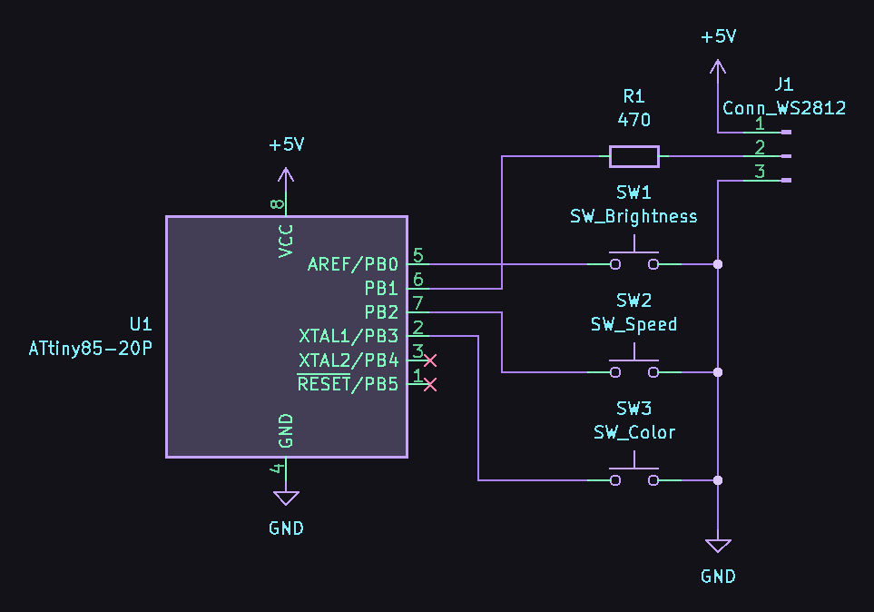

# led-strip

## Overview

LED strip animation on ATtiny85 and WS2812.


## Requirements

- [Arduino IDE](https://www.arduino.cc/en/software/)
- [Git](https://git-scm.com/)
- [Make](https://www.gnu.org/software/make/)
- [Micronucleus](https://github.com/micronucleus/micronucleus)

## Schematic



## Configuration

The default configuration is for an ATtiny85 microcontroller with Micronucleus bootloader and a WS2812 strip with 32 LEDs.

To use a different microcontroller or bootloader, edit [`Makefile`](Makefile).
To use a different LED strip, edit [`config.h`](src/config.h).

## Building

```bash
git submodule update --init
make
```

## Uploading

```bash
make upload
```

### With Micronucleus

```bash
make microload
```

### With an ISP

```bash
make ispload
```

## Licenses

- [`led-strip`](LICENSE)
